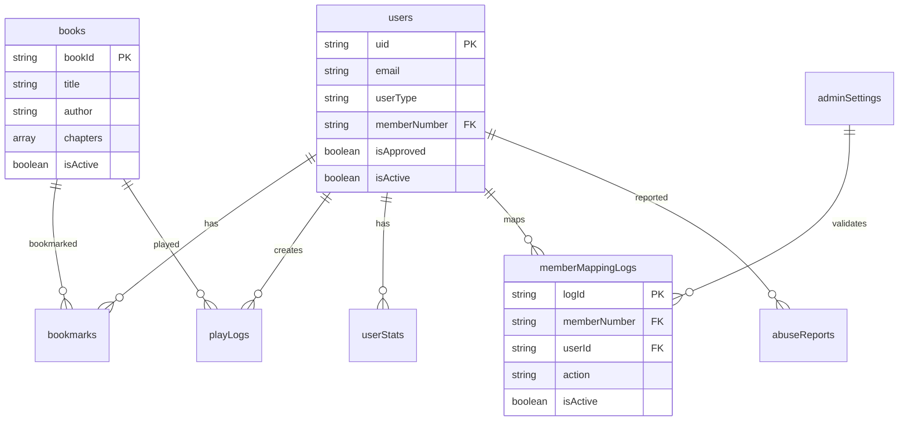

# 주안의소리 - 데이터베이스 스키마 설계서

**Database Schema Design Document v1.0**  
**프로젝트명**: 주안의소리 (Voice of Juan)  
**문서 작성일**: 2025년 6월 29일  
**담당자**: Database Team  
**승인자**: Tech Lead  
**관련 문서**: PRD v1.0, FRD v1.1, System Architecture v1.0, API Specification v1.0

---

## 1. 문서 개요

### 1.1 목적
본 문서는 주안의소리 시각장애인용 오디오북 앱의 Firebase Firestore 기반 데이터베이스 스키마를 상세히 정의하고, 데이터 무결성, 성능 최적화, 보안을 고려한 설계 사항을 명시합니다.

### 1.2 데이터베이스 아키텍처
- **Database**: Cloud Firestore (NoSQL Document Database)
- **Location**: asia-northeast1 (Seoul, South Korea)
- **Backup**: 일일 자동 백업 + 증분 백업
- **Security**: Firebase Security Rules + IAM
- **Scaling**: Auto-scaling (최대 1,000 동시 연결)

### 1.3 설계 원칙
- **데이터 무결성**: 1계정-1성도번호 매핑 보장
- **성능 최적화**: 적절한 인덱스 설계 및 쿼리 최적화
- **보안 강화**: 사용자별 데이터 격리 및 접근 제어
- **확장성**: 사용자 증가에 따른 스케일링 고려
- **감사 추적**: 모든 중요 작업에 대한 로그 기록

### 1.4 명명 규칙
- **컬렉션명**: camelCase (예: `memberMappingLogs`)
- **필드명**: camelCase (예: `createdAt`, `isActive`)
- **문서 ID**: snake_case with prefix (예: `user_12345`, `book_abcd`)
- **인덱스명**: 기능_필드조합 (예: `user_approval_status_date`)

---

## 2. 데이터베이스 전체 구조

### 2.1 컬렉션 Overview
```
Firebase Firestore Database
├── users                    (사용자 기본 정보)
├── books                    (도서 메타데이터)
├── bookmarks               (북마크 및 재생 위치)
├── userStats               (사용자 통계 및 활동)
├── playLogs                (재생 로그 및 이벤트)
├── adminSettings           (관리자 설정 및 구성)
├── memberMappingLogs       (성도번호 매핑 이력)
├── abuseReports           (어뷰저 신고 및 처리)
└── systemLogs             (시스템 감사 로그)
```

### 2.2 데이터 관계도


---

## 3. 컬렉션 상세 설계

### 3.1 users 컬렉션

#### 3.1.1 컬렉션 정보
- **목적**: 사용자 기본 정보 및 인증 상태 관리
- **문서 ID**: Firebase Auth UID 사용
- **예상 문서 수**: 10,000개 (초기), 100,000개 (장기)
- **읽기/쓰기 비율**: 80% 읽기, 20% 쓰기

#### 3.1.2 스키마 정의
```typescript
interface UserDocument {
  // 기본 정보
  uid: string;                    // Firebase Auth UID (Primary Key)
  email: string;                  // 이메일 주소 (Unique, Required)
  displayName: string;            // 표시 이름 (Required)
  profileImageUrl?: string;       // 프로필 이미지 URL (Optional)
  
  // 사용자 타입 및 상태
  userType: 'member' | 'external';     // 성도/외부 사용자 구분 (Required)
  memberNumber?: string;               // 교회 성도번호 (성도인 경우 Required)
  memberMappedAt?: Timestamp;          // 성도번호 매핑 시점
  isApproved: boolean;                 // 승인 여부 (Default: false)
  isActive: boolean;                   // 계정 활성화 여부 (Default: true)
  
  // 승인 관련 정보 (외부 사용자)
  approvalRequest?: {
    name: string;                      // 실명
    phone: string;                     // 연락처 (010-0000-0000 형식)
    purpose: string;                   // 이용 목적 (최소 10자)
    requestedAt: Timestamp;            // 요청 시점
    reviewedAt?: Timestamp;            // 검토 시점
    reviewedBy?: string;               // 검토자 UID
    rejectionReason?: string;          // 거부 사유
  };
  
  // 접속 정보
  lastLoginAt?: Timestamp;       // 마지막 로그인 시간
  lastLoginIP?: string;          // 마지막 로그인 IP
  deviceInfo?: {
    platform: string;           // android, ios, web
    version: string;             // 앱 버전
    model: string;               // 기기 모델
    osVersion: string;           // OS 버전
  };
  
  // 계정 관리
  createdAt: Timestamp;          // 계정 생성 시간 (Required)
  updatedAt: Timestamp;          // 마지막 업데이트 시간
  suspendedAt?: Timestamp;       // 정지 시점
  suspendedBy?: string;          // 정지 처리자 UID
  suspensionReason?: string;     // 정지 사유
  suspensionExpiresAt?: Timestamp;  // 정지 만료 시점
  
  // 통계 요약 (비정규화)
  totalListeningTime: number;    // 총 청취 시간 (초 단위)
  totalSessions: number;         // 총 세션 수
  lastBookId?: string;           // 마지막 들은 도서 ID
  
  // 메타데이터
  version: number;               // 문서 버전 (낙관적 잠금)
}
```

#### 3.1.3 제약 조건 및 검증 규칙
```typescript
// Firestore Security Rules for users collection
rules_version = '2';
service cloud.firestore {
  match /databases/{database}/documents {
    match /users/{userId} {
      allow read, write: if request.auth != null && 
                           request.auth.uid == userId;
      
      allow create: if request.auth != null &&
                      request.auth.uid == userId &&
                      validateUserCreation(request.resource.data);
      
      allow update: if request.auth != null &&
                      request.auth.uid == userId &&
                      validateUserUpdate(request.resource.data, resource.data);
      
      // 관리자는 모든 사용자 읽기/쓰기 가능
      allow read, write: if hasAdminRole(request.auth.uid);
    }
  }
}

function validateUserCreation(data) {
  return data.keys().hasAll(['uid', 'email', 'displayName', 'userType', 'isApproved', 'isActive', 'createdAt']) &&
         data.uid == request.auth.uid &&
         data.email == request.auth.token.email &&
         data.userType in ['member', 'external'] &&
         data.isApproved == false &&
         data.isActive == true &&
         data.totalListeningTime == 0 &&
         data.totalSessions == 0;
}

function validateUserUpdate(newData, oldData) {
  // 변경 불가 필드 검증
  return newData.uid == oldData.uid &&
         newData.email == oldData.email &&
         newData.createdAt == oldData.createdAt &&
         // memberNumber는 한 번만 설정 가능
         (oldData.memberNumber == null || newData.memberNumber == oldData.memberNumber);
}
```

#### 3.1.4 인덱스 설계
```javascript
// Single Field Indexes (자동 생성)
// - uid (Document ID이므로 자동)
// - email
// - userType
// - isApproved
// - isActive
// - memberNumber
// - createdAt
// - lastLoginAt

// Composite Indexes (수동 생성 필요)
[
  {
    collectionGroup: "users",
    fields: [
      { fieldPath: "userType", order: "ASCENDING" },
      { fieldPath: "isApproved", order: "ASCENDING" },
      { fieldPath: "createdAt", order: "DESCENDING" }
    ]
  },
  {
    collectionGroup: "users",
    fields: [
      { fieldPath: "isActive", order: "ASCENDING" },
      { fieldPath: "lastLoginAt", order: "DESCENDING" }
    ]
  },
  {
    collectionGroup: "users",
    fields: [
      { fieldPath: "userType", order: "ASCENDING" },
      { fieldPath: "memberNumber", order: "ASCENDING" }
    ]
  },
  {
    collectionGroup: "users",
    fields: [
      { fieldPath: "isApproved", order: "ASCENDING" },
      { fieldPath: "approvalRequest.requestedAt", order: "ASCENDING" }
    ]
  }
]
```

### 3.2 books 컬렉션

#### 3.2.1 컬렉션 정보
- **목적**: 오디오북 메타데이터 및 챕터 정보 관리
- **문서 ID**: `book_` + UUID 형식
- **예상 문서 수**: 1,000개 (초기), 10,000개 (장기)
- **읽기/쓰기 비율**: 95% 읽기, 5% 쓰기

#### 3.2.2 스키마 정의
```typescript
interface BookDocument {
  // 기본 정보
  bookId: string;                // 도서 고유 ID (Primary Key)
  title: string;                 // 도서 제목 (Required, 최대 200자)
  author: string;                // 저자명 (Required, 최대 100자)
  description: string;           // 도서 설명 (최대 2000자)
  coverImageUrl: string;         // 표지 이미지 URL (Required)
  
  // 분류 정보
  category: string;              // 카테고리 (Required)
  subCategory?: string;          // 하위 카테고리
  tags: string[];                // 태그 배열 (최대 10개)
  isbn?: string;                 // ISBN (13자리)
  publisher?: string;            // 출판사
  publishedDate?: string;        // 출간일 (YYYY-MM-DD)
  
  // 오디오 정보
  totalDuration: number;         // 총 재생 시간 (초 단위)
  totalChapters: number;         // 총 챕터 수
  narrator?: string;             // 내레이터
  language: string;              // 언어 (기본값: 'ko')
  
  // 챕터 정보
  chapters: Array<{
    chapterIndex: number;        // 챕터 순서 (1부터 시작)
    title: string;               // 챕터 제목
    duration: number;            // 챕터 재생 시간 (초)
    fileSize: number;            // 파일 크기 (bytes)
    storagePath: string;         // Firebase Storage 경로
    streamingUrl?: string;       // CDN 스트리밍 URL
    transcoded: boolean;         // 트랜스코딩 완료 여부
  }>;
  
  // 품질 정보
  audioQuality: {
    originalBitrate: number;     // 원본 비트레이트
    availableQualities: Array<{
      quality: 'low' | 'medium' | 'high';
      bitrate: number;
      fileSize: number;
      storagePath: string;
    }>;
  };
  
  // 상태 정보
  isActive: boolean;             // 활성화 상태 (Default: false)
  processingStatus: 'pending' | 'processing' | 'completed' | 'failed';
  uploadedBy: string;            // 업로드한 관리자 UID
  
  // 통계 정보 (비정규화)
  playCount: number;             // 총 재생 횟수 (Default: 0)
  totalPlayTime: number;         // 총 재생 시간 (Default: 0)
  averageRating?: number;        // 평균 평점 (1-5)
  ratingCount?: number;          // 평점 참여자 수
  completionRate?: number;       // 완주율 (0-1)
  
  // 메타데이터
  createdAt: Timestamp;          // 생성 시간
  updatedAt: Timestamp;          // 수정 시간
  activatedAt?: Timestamp;       // 활성화 시간
  deactivatedAt?: Timestamp;     // 비활성화 시간
  version: number;               // 문서 버전
}
```

#### 3.2.3 제약 조건 및 검증 규칙
```typescript
// Firestore Security Rules for books collection
match /books/{bookId} {
  // 승인된 사용자만 읽기 가능
  allow read: if request.auth != null && 
                 isApprovedActiveUser(request.auth.uid) &&
                 resource.data.isActive == true;
  
  // 관리자만 쓰기 가능
  allow write: if hasAdminRole(request.auth.uid);
  
  allow create: if hasAdminRole(request.auth.uid) &&
                   validateBookCreation(request.resource.data);
  
  allow update: if hasAdminRole(request.auth.uid) &&
                   validateBookUpdate(request.resource.data, resource.data);
}

function validateBookCreation(data) {
  return data.keys().hasAll(['bookId', 'title', 'author', 'description', 'coverImageUrl', 'category', 'totalDuration', 'totalChapters', 'chapters', 'isActive', 'processingStatus', 'uploadedBy', 'createdAt']) &&
         data.title.size() > 0 && data.title.size() <= 200 &&
         data.author.size() > 0 && data.author.size() <= 100 &&
         data.description.size() <= 2000 &&
         data.totalChapters > 0 &&
         data.chapters.size() == data.totalChapters &&
         data.playCount == 0 &&
         data.totalPlayTime == 0 &&
         data.uploadedBy == request.auth.uid;
}

function validateBookUpdate(newData, oldData) {
  // 변경 불가 필드 검증
  return newData.bookId == oldData.bookId &&
         newData.createdAt == oldData.createdAt &&
         newData.uploadedBy == oldData.uploadedBy &&
         // 통계 필드는 증가만 가능
         newData.playCount >= oldData.playCount &&
         newData.totalPlayTime >= oldData.totalPlayTime;
}
```

#### 3.2.4 인덱스 설계
```javascript
// Composite Indexes for books collection
[
  {
    collectionGroup: "books",
    fields: [
      { fieldPath: "isActive", order: "ASCENDING" },
      { fieldPath: "createdAt", order: "DESCENDING" }
    ]
  },
  {
    collectionGroup: "books",
    fields: [
      { fieldPath: "category", order: "ASCENDING" },
      { fieldPath: "isActive", order: "ASCENDING" },
      { fieldPath: "playCount", order: "DESCENDING" }
    ]
  },
  {
    collectionGroup: "books",
    fields: [
      { fieldPath: "isActive", order: "ASCENDING" },
      { fieldPath: "title", order: "ASCENDING" }
    ]
  },
  {
    collectionGroup: "books",
    fields: [
      { fieldPath: "isActive", order: "ASCENDING" },
      { fieldPath: "author", order: "ASCENDING" }
    ]
  },
  {
    collectionGroup: "books",
    fields: [
      { fieldPath: "processingStatus", order: "ASCENDING" },
      { fieldPath: "createdAt", order: "ASCENDING" }
    ]
  }
]
```

### 3.3 bookmarks 컬렉션

#### 3.3.1 컬렉션 정보
- **목적**: 사용자별 북마크 및 재생 위치 저장
- **문서 ID**: `${userId}_${bookId}` 복합키 사용
- **예상 문서 수**: 50,000개 (초기), 500,000개 (장기)
- **읽기/쓰기 비율**: 60% 읽기, 40% 쓰기

#### 3.3.2 스키마 정의
```typescript
interface BookmarkDocument {
  // 복합 키 정보
  bookmarkId: string;            // ${userId}_${bookId} 형태
  userId: string;                // 사용자 UID (Foreign Key)
  bookId: string;                // 도서 ID (Foreign Key)
  
  // 재생 위치 정보
  chapterIndex: number;          // 현재 챕터 (1부터 시작)
  positionSeconds: number;       // 챕터 내 재생 위치 (초)
  totalProgressSeconds: number;  // 전체 도서 내 진행 위치 (초)
  progressPercentage: number;    // 진행률 (0-100)
  
  // 북마크 정보
  note?: string;                 // 사용자 메모 (최대 500자)
  isManualBookmark: boolean;     // 수동 북마크 여부 (Default: false)
  
  // 메타데이터 (성능 최적화용 비정규화)
  bookTitle: string;             // 도서 제목
  bookCoverUrl: string;          // 도서 표지 URL
  chapterTitle: string;          // 챕터 제목
  totalDuration: number;         // 전체 도서 길이 (초)
  
  // 타임스탬프
  createdAt: Timestamp;          // 최초 북마크 생성 시간
  lastUpdated: Timestamp;        // 마지막 업데이트 시간
  lastAccessedAt: Timestamp;     // 마지막 접근 시간
  
  // 동기화 정보
  deviceId?: string;             // 마지막 업데이트한 기기 ID
  syncVersion: number;           // 동기화 버전 (충돌 해결용)
}
```

#### 3.3.3 제약 조건 및 검증 규칙
```typescript
// Firestore Security Rules for bookmarks collection
match /bookmarks/{bookmarkId} {
  // 본인의 북마크만 읽기/쓰기 가능
  allow read, write: if request.auth != null && 
                        resource.data.userId == request.auth.uid &&
                        isApprovedActiveUser(request.auth.uid);
  
  allow create: if request.auth != null &&
                   request.resource.data.userId == request.auth.uid &&
                   isApprovedActiveUser(request.auth.uid) &&
                   validateBookmarkCreation(request.resource.data);
  
  allow update: if request.auth != null &&
                   resource.data.userId == request.auth.uid &&
                   isApprovedActiveUser(request.auth.uid) &&
                   validateBookmarkUpdate(request.resource.data, resource.data);
  
  // 관리자는 모든 북마크 읽기 가능 (통계 목적)
  allow read: if hasAdminRole(request.auth.uid);
}

function validateBookmarkCreation(data) {
  return data.keys().hasAll(['bookmarkId', 'userId', 'bookId', 'chapterIndex', 'positionSeconds', 'totalProgressSeconds', 'progressPercentage', 'isManualBookmark', 'createdAt', 'lastUpdated', 'lastAccessedAt', 'syncVersion']) &&
         data.userId == request.auth.uid &&
         data.bookmarkId == data.userId + '_' + data.bookId &&
         data.chapterIndex >= 1 &&
         data.positionSeconds >= 0 &&
         data.totalProgressSeconds >= 0 &&
         data.progressPercentage >= 0 && data.progressPercentage <= 100 &&
         data.syncVersion == 1;
}

function validateBookmarkUpdate(newData, oldData) {
  return newData.bookmarkId == oldData.bookmarkId &&
         newData.userId == oldData.userId &&
         newData.bookId == oldData.bookId &&
         newData.createdAt == oldData.createdAt &&
         // 재생 위치는 앞으로만 이동 가능 (되감기 제외)
         (newData.totalProgressSeconds >= oldData.totalProgressSeconds || 
          timestamp.date(newData.lastUpdated).toMillis() - timestamp.date(oldData.lastUpdated).toMillis() < 30000) &&
         newData.syncVersion >= oldData.syncVersion;
}
```

### 3.4 memberMappingLogs 컬렉션

#### 3.4.1 컬렉션 정보
- **목적**: 성도번호 매핑 이력 추적 및 어뷰저 방지
- **문서 ID**: 자동 생성 UUID
- **예상 문서 수**: 20,000개 (초기), 200,000개 (장기)
- **읽기/쓰기 비율**: 30% 읽기, 70% 쓰기

#### 3.4.2 스키마 정의
```typescript
interface MemberMappingLogDocument {
  // 기본 정보
  logId: string;                 // 로그 고유 ID (Primary Key)
  memberNumber: string;          // 성도번호
  userId: string;                // 사용자 UID
  
  // 액션 정보
  action: 'mapped' | 'unmapped' | 'forced_unmapped' | 'validation_failed';
  previousUserId?: string;       // 이전에 매핑된 사용자 UID (언매핑 시)
  
  // 상태 정보
  isActive: boolean;             // 현재 매핑 상태 (최신 매핑만 true)
  isValid: boolean;              // 매핑 유효성 (성도번호 존재 여부)
  
  // 처리 정보
  timestamp: Timestamp;          // 액션 발생 시간
  processedBy: string;           // 처리자 ('system' | admin_uid | user_uid)
  reason?: string;               // 처리 사유 (강제 해제, 어뷰저 등)
  
  // 보안 정보
  userIP: string;                // 사용자 IP 주소
  userAgent?: string;            // User Agent 정보
  deviceFingerprint?: string;    // 기기 핑거프린트
  
  // 검증 정보
  validationSource: 'admin_list' | 'church_db' | 'manual_approval';
  validationChecksum?: string;   // 성도번호 검증 체크섬
  
  // 어뷰저 감지 관련
  riskScore?: number;            // 위험도 점수 (0-100)
  riskFactors?: string[];        // 위험 요소 배열
  autoFlagged: boolean;          // 자동 플래그 여부
  
  // 메타데이터
  version: number;               // 로그 버전
  expiresAt?: Timestamp;         // 로그 만료 시간 (GDPR 준수)
}
```

#### 3.4.3 제약 조건 및 검증 규칙
```typescript
// Firestore Security Rules for memberMappingLogs collection
match /memberMappingLogs/{logId} {
  // 관리자만 읽기/쓰기 가능
  allow read, write: if hasAdminRole(request.auth.uid);
  
  // 시스템 함수에서만 생성 가능
  allow create: if request.auth != null &&
                   (hasAdminRole(request.auth.uid) || isSystemRequest()) &&
                   validateMappingLogCreation(request.resource.data);
  
  // 수정은 관리자만 가능 (상태 변경, 사유 추가 등)
  allow update: if hasAdminRole(request.auth.uid) &&
                   validateMappingLogUpdate(request.resource.data, resource.data);
}

function validateMappingLogCreation(data) {
  return data.keys().hasAll(['logId', 'memberNumber', 'userId', 'action', 'isActive', 'isValid', 'timestamp', 'processedBy', 'userIP', 'validationSource', 'autoFlagged', 'version']) &&
         data.action in ['mapped', 'unmapped', 'forced_unmapped', 'validation_failed'] &&
         data.memberNumber.matches('^[0-9]{4,8}$') &&
         data.version == 1;
}

function isSystemRequest() {
  // Cloud Function에서 호출하는 경우 특별한 토큰 사용
  return request.auth.token.system == true;
}
```

#### 3.4.4 인덱스 설계
```javascript
// Composite Indexes for memberMappingLogs collection
[
  {
    collectionGroup: "memberMappingLogs",
    fields: [
      { fieldPath: "memberNumber", order: "ASCENDING" },
      { fieldPath: "isActive", order: "ASCENDING" },
      { fieldPath: "timestamp", order: "DESCENDING" }
    ]
  },
  {
    collectionGroup: "memberMappingLogs",
    fields: [
      { fieldPath: "userId", order: "ASCENDING" },
      { fieldPath: "timestamp", order: "DESCENDING" }
    ]
  },
  {
    collectionGroup: "memberMappingLogs",
    fields: [
      { fieldPath: "action", order: "ASCENDING" },
      { fieldPath: "timestamp", order: "DESCENDING" }
    ]
  },
  {
    collectionGroup: "memberMappingLogs",
    fields: [
      { fieldPath: "autoFlagged", order: "ASCENDING" },
      { fieldPath: "riskScore", order: "DESCENDING" },
      { fieldPath: "timestamp", order: "DESCENDING" }
    ]
  },
  {
    collectionGroup: "memberMappingLogs",
    fields: [
      { fieldPath: "userIP", order: "ASCENDING" },
      { fieldPath: "timestamp", order: "DESCENDING" }
    ]
  }
]
```

### 3.5 abuseReports 컬렉션

#### 3.5.1 컬렉션 정보
- **목적**: 어뷰저 신고 및 처리 이력 관리
- **문서 ID**: `report_` + UUID
- **예상 문서 수**: 5,000개 (초기), 50,000개 (장기)
- **읽기/쓰기 비율**: 40% 읽기, 60% 쓰기

#### 3.5.2 스키마 정의
```typescript
interface AbuseReportDocument {
  // 신고 기본 정보
  reportId: string;              // 신고 고유 ID
  reportedUserId: string;        // 신고된 사용자 UID
  reportedBy: string;            // 신고자 ('system' | admin_uid)
  
  // 신고 분류
  reportType: 'invalid_member_number' | 'suspicious_activity' | 'multiple_accounts' | 'unauthorized_sharing' | 'other';
  severity: 'low' | 'medium' | 'high' | 'critical';
  category: 'automated' | 'manual' | 'user_reported';
  
  // 신고 내용
  title: string;                 // 신고 제목
  description: string;           // 신고 상세 내용
  tags: string[];                // 태그 배열
  
  // 상태 관리
  status: 'pending' | 'investigating' | 'resolved' | 'dismissed' | 'escalated';
  priority: number;              // 우선순위 (1-5, 5가 가장 높음)
  
  // 증거 및 데이터
  evidences: Array<{
    type: 'log' | 'screenshot' | 'ip_trace' | 'device_info' | 'behavior_pattern';
    description: string;
    data: any;                   // 증거 데이터 (JSON)
    timestamp: Timestamp;
    collectedBy: string;
  }>;
  
  // 관련 사용자 정보 (비정규화)
  reportedUserInfo: {
    email: string;
    displayName: string;
    userType: string;
    memberNumber?: string;
    registrationDate: Timestamp;
    lastLoginAt?: Timestamp;
    totalSessions: number;
  };
  
  // AI 분석 결과
  aiAnalysis?: {
    riskScore: number;           // AI 계산 위험도 (0-100)
    confidence: number;          // 신뢰도 (0-1)
    patterns: string[];          // 감지된 패턴
    recommendations: string[];   // AI 권장 조치
    analysisTimestamp: Timestamp;
    modelVersion: string;
  };
  
  // 처리 이력
  actions: Array<{
    actionType: 'flagged' | 'investigated' | 'warning_sent' | 'account_suspended' | 'account_terminated' | 'dismissed';
    performedBy: string;
    timestamp: Timestamp;
    reason: string;
    details?: any;
  }>;
  
  // 해결 정보
  resolution?: {
    outcome: 'confirmed_abuse' | 'false_positive' | 'insufficient_evidence' | 'policy_violation';
    finalAction: string;
    resolvedBy: string;
    resolvedAt: Timestamp;
    resolutionNotes: string;
  };
  
  // 타임스탬프
  createdAt: Timestamp;
  updatedAt: Timestamp;
  investigatedAt?: Timestamp;
  resolvedAt?: Timestamp;
  
  // 메타데이터
  relatedReportIds?: string[];   // 관련 신고 ID들
  escalationLevel: number;       // 에스컬레이션 단계 (0-3)
  version: number;
}
```

### 3.6 playLogs 컬렉션

#### 3.6.1 컬렉션 정보
- **목적**: 사용자 재생 로그 및 통계 데이터 수집
- **문서 ID**: 자동 생성 UUID
- **예상 문서 수**: 1,000,000개 (초기), 10,000,000개 (장기)
- **읽기/쓰기 비율**: 20% 읽기, 80% 쓰기
- **TTL**: 2년 (자동 삭제)

#### 3.6.2 스키마 정의
```typescript
interface PlayLogDocument {
  // 기본 정보
  logId: string;                 // 로그 고유 ID
  userId: string;                // 사용자 UID
  bookId: string;                // 도서 ID
  chapterIndex: number;          // 챕터 번호
  
  // 재생 이벤트 정보
  action: 'start' | 'pause' | 'resume' | 'seek' | 'complete' | 'skip' | 'error';
  positionSeconds: number;       // 재생 위치 (초)
  previousPositionSeconds?: number;  // 이전 위치 (seek 시)
  sessionId: string;             // 세션 ID
  
  // 세션 정보
  sessionStartTime: Timestamp;   // 세션 시작 시간
  sessionDuration?: number;      // 세션 지속 시간 (초)
  continuousPlayTime?: number;   // 연속 재생 시간 (초)
  
  // 기술 정보
  streamingQuality: 'low' | 'medium' | 'high';
  playbackSpeed: number;         // 재생 속도 (0.5-2.0)
  networkType: 'wifi' | 'cellular' | 'ethernet' | 'unknown';
  
  // 디바이스 정보
  deviceInfo: {
    platform: string;           // android, ios, web
    appVersion: string;          // 앱 버전
    osVersion: string;           // OS 버전
    deviceModel: string;         // 기기 모델
    screenSize?: string;         // 화면 크기
  };
  
  // 위치 정보
  userIP: string;                // 사용자 IP
  geolocation?: {
    country: string;
    region: string;
    city: string;
    coordinates?: [number, number]; // [latitude, longitude]
  };
  
  // 오류 정보 (action이 'error'인 경우)
  errorInfo?: {
    errorCode: string;
    errorMessage: string;
    stackTrace?: string;
    recoveryAction?: string;
  };
  
  // 분석 정보
  isValidPlay: boolean;          // 유효한 재생인지 (봇 제외)
  engagementScore?: number;      // 참여도 점수 (0-100)
  
  // 타임스탬프
  timestamp: Timestamp;          // 이벤트 발생 시간
  serverTimestamp: Timestamp;    // 서버 수신 시간
  
  // 메타데이터
  batchId?: string;              // 배치 처리 ID
  version: number;
  expiresAt?: Timestamp;         // TTL 만료 시간 (2년 후)
}
```

### 3.7 userStats 컬렉션

#### 3.7.1 컬렉션 정보
- **목적**: 사용자별 통계 및 성취 데이터 관리
- **문서 ID**: 사용자 UID 사용
- **예상 문서 수**: 10,000개 (초기), 100,000개 (장기)
- **읽기/쓰기 비율**: 70% 읽기, 30% 쓰기

#### 3.7.2 스키마 정의
```typescript
interface UserStatsDocument {
  // 기본 정보
  userId: string;                // 사용자 UID (Primary Key)
  
  // 전체 통계
  totalListeningTime: number;    // 총 청취 시간 (초)
  totalSessions: number;         // 총 세션 수
  totalBooksStarted: number;     // 시작한 도서 수
  totalBooksCompleted: number;   // 완료한 도서 수
  averageSessionDuration: number; // 평균 세션 길이 (초)
  longestSession: number;        // 최장 세션 길이 (초)
  
  // 기간별 통계
  dailyStats: Array<{
    date: string;                // YYYY-MM-DD 형식
    listeningTime: number;       // 일일 청취 시간 (초)
    sessions: number;            // 일일 세션 수
    booksListened: number;       // 들은 도서 수
    chaptersCompleted: number;   // 완료한 챕터 수
  }>;
  
  // 주간 통계 (최근 12주)
  weeklyStats: Array<{
    weekStart: string;           // YYYY-MM-DD (월요일)
    listeningTime: number;
    sessions: number;
    booksCompleted: number;
    streakDays: number;          // 연속 청취 일수
  }>;
  
  // 월간 통계 (최근 12개월)
  monthlyStats: Array<{
    month: string;               // YYYY-MM 형식
    listeningTime: number;
    sessions: number;
    booksCompleted: number;
    newGenresExplored: number;
  }>;
  
  // 카테고리별 통계
  categoryStats: Map<string, {
    listeningTime: number;
    booksCompleted: number;
    averageRating?: number;
    favoriteBooks: string[];     // 도서 ID 배열
  }>;
  
  // 청취 패턴
  listeningPatterns: {
    preferredTimes: Array<{      // 선호 청취 시간대
      hour: number;              // 0-23
      frequency: number;         // 빈도
    }>;
    averageSpeed: number;        // 평균 재생 속도
    skipRate: number;            // 건너뛰기 비율 (0-1)
    pauseFrequency: number;      // 일시정지 빈도 (회/시간)
    deviceUsage: Map<string, number>; // 기기별 사용 시간
  };
  
  // 현재 진행 상황
  currentlyReading: Array<{
    bookId: string;
    bookTitle: string;
    progress: number;            // 진행률 (0-100)
    lastAccessedAt: Timestamp;
    estimatedTimeToComplete: number; // 예상 완료 시간 (초)
  }>;
  
  // 최근 활동
  recentActivity: Array<{
    type: 'started_book' | 'completed_book' | 'completed_chapter' | 'achievement_unlocked';
    bookId?: string;
    bookTitle?: string;
    achievementId?: string;
    timestamp: Timestamp;
  }>;
  
  // 성취 시스템
  achievements: Array<{
    achievementId: string;
    title: string;
    description: string;
    unlockedAt: Timestamp;
    category: string;
    points: number;
  }>;
  
  // 진행 중인 목표
  progressTowards: Array<{
    achievementId: string;
    currentValue: number;
    targetValue: number;
    progress: number;            // 0-100
  }>;
  
  // 선호도 및 추천
  preferences: {
    favoriteCategories: string[];
    favoriteAuthors: string[];
    preferredDuration: string;   // 'short' | 'medium' | 'long'
    preferredNarrators: string[];
    blacklistedCategories: string[];
  };
  
  // 소셜 기능 (향후 확장)
  social?: {
    friendsCount: number;
    reviewsWritten: number;
    helpfulVotes: number;
    followersCount: number;
  };
  
  // 마지막 업데이트 정보
  lastCalculatedAt: Timestamp;   // 통계 마지막 계산 시간
  nextCalculationAt: Timestamp;  // 다음 계산 예정 시간
  calculationVersion: number;    // 계산 알고리즘 버전
  
  // 메타데이터
  createdAt: Timestamp;
  updatedAt: Timestamp;
  version: number;
}
```

### 3.8 adminSettings 컬렉션

#### 3.8.1 컬렉션 정보
- **목적**: 시스템 설정 및 관리자 구성 관리
- **문서 ID**: 설정 타입별 고정 ID 사용
- **예상 문서 수**: 50개 (초기), 100개 (장기)
- **읽기/쓰기 비율**: 90% 읽기, 10% 쓰기

#### 3.8.2 스키마 정의
```typescript
interface AdminSettingsDocument {
  // 기본 정보
  settingId: string;             // 설정 고유 ID
  settingType: 'member_numbers' | 'system_config' | 'abuse_detection' | 'content_policy' | 'notification_config';
  
  // 성도번호 관리 (settingId: 'valid_member_numbers')
  memberNumbersConfig?: {
    validMemberNumbers: string[]; // 유효한 성도번호 목록
    lastUpdatedBy: string;        // 마지막 업데이트한 관리자
    lastUpdatedAt: Timestamp;     // 마지막 업데이트 시간
    source: 'manual' | 'import' | 'church_db';
    totalCount: number;
    checksum: string;             // 데이터 무결성 검증
  };
  
  // 시스템 설정 (settingId: 'system_config')
  systemConfig?: {
    maintenanceMode: boolean;
    allowNewRegistrations: boolean;
    autoApprovalEnabled: boolean;
    maxConcurrentUsers: number;
    maxConcurrentStreams: number; // 계정당 동시 스트리밍 제한
    sessionTimeoutMinutes: number;
    fileUploadMaxSize: number;    // MB 단위
    supportedAudioFormats: string[];
    defaultStreamingQuality: string;
    enableAnalytics: boolean;
  };
  
  // 어뷰저 감지 설정 (settingId: 'abuse_detection')
  abuseDetectionConfig?: {
    enabled: boolean;
    riskThreshold: number;        // 자동 플래그 임계값 (0-100)
    autoSuspendThreshold: number; // 자동 정지 임계값
    ipBlockingEnabled: boolean;
    deviceLimitPerAccount: number;
    rapidRegistrationThreshold: number; // 단시간 가입 제한
    
    // 감지 규칙
    rules: Array<{
      ruleId: string;
      name: string;
      description: string;
      enabled: boolean;
      severity: 'low' | 'medium' | 'high' | 'critical';
      conditions: any;           // 규칙 조건 (JSON)
      actions: string[];         // 적용할 액션
    }>;
  };
  
  // 콘텐츠 정책 (settingId: 'content_policy')
  contentPolicy?: {
    autoActivateBooks: boolean;
    requireManualReview: boolean;
    maxBookSizeMB: number;
    maxChapterCount: number;
    allowedCategories: string[];
    bannedKeywords: string[];
    copyrightCheckEnabled: boolean;
    qualityCheckEnabled: boolean;
  };
  
  // 알림 설정 (settingId: 'notification_config')
  notificationConfig?: {
    emailNotificationsEnabled: boolean;
    slackNotificationsEnabled: boolean;
    webhookUrl?: string;
    
    // 알림 조건
    notifyOnNewUser: boolean;
    notifyOnAbuseDetection: boolean;
    notifyOnSystemError: boolean;
    notifyOnHighLoad: boolean;
    
    // 알림 채널별 설정
    channels: Array<{
      type: 'email' | 'slack' | 'webhook';
      enabled: boolean;
      recipients: string[];
      messageTemplate?: string;
    }>;
  };
  
  // 메타데이터
  isActive: boolean;
  createdAt: Timestamp;
  updatedAt: Timestamp;
  updatedBy: string;             // 마지막 수정한 관리자 UID
  version: number;
  
  // 접근 제어
  accessLevel: 'super_admin' | 'admin' | 'moderator';
  allowedRoles: string[];
}
```

### 3.9 systemLogs 컬렉션

#### 3.9.1 컬렉션 정보
- **목적**: 시스템 감사 로그 및 보안 이벤트 기록
- **문서 ID**: 자동 생성 UUID
- **예상 문서 수**: 500,000개 (초기), 5,000,000개 (장기)
- **읽기/쓰기 비율**: 10% 읽기, 90% 쓰기
- **TTL**: 1년 (자동 삭제)

#### 3.9.2 스키마 정의
```typescript
interface SystemLogDocument {
  // 기본 정보
  logId: string;                 // 로그 고유 ID
  logLevel: 'DEBUG' | 'INFO' | 'WARN' | 'ERROR' | 'CRITICAL';
  source: 'mobile_app' | 'web_admin' | 'cloud_function' | 'firebase_auth' | 'firestore' | 'storage';
  
  // 이벤트 분류
  eventType: 'user_action' | 'system_event' | 'security_event' | 'error_event' | 'performance_event';
  category: string;              // 세부 카테고리
  action: string;                // 수행된 액션
  
  // 메시지 정보
  message: string;               // 로그 메시지
  details?: any;                 // 추가 상세 정보 (JSON)
  errorCode?: string;            // 에러 코드
  stackTrace?: string;           // 스택 트레이스
  
  // 사용자 정보
  userId?: string;               // 연관된 사용자 UID
  sessionId?: string;            // 세션 ID
  requestId?: string;            // 요청 ID
  
  // 네트워크 정보
  ipAddress?: string;            // IP 주소
  userAgent?: string;            // User Agent
  referer?: string;              // 참조 URL
  
  // 성능 정보
  duration?: number;             // 처리 시간 (밀리초)
  memoryUsage?: number;          // 메모리 사용량 (bytes)
  cpuUsage?: number;             // CPU 사용률 (%)
  
  // 보안 관련
  riskLevel?: 'low' | 'medium' | 'high' | 'critical';
  securityFlags?: string[];      // 보안 플래그
  geoLocation?: {
    country: string;
    region: string;
    city: string;
  };
  
  // 메타데이터
  timestamp: Timestamp;          // 이벤트 발생 시간
  serverTimestamp: Timestamp;    // 서버 수신 시간
  environment: 'development' | 'staging' | 'production';
  version: string;               // 앱/시스템 버전
  
  // 관련 데이터
  relatedLogIds?: string[];      // 관련 로그 ID들
  parentLogId?: string;          // 부모 로그 ID
  correlationId?: string;        // 상관관계 ID
  
  // TTL
  expiresAt: Timestamp;          // 자동 삭제 시간 (1년 후)
}
```

---

## 4. 인덱스 설계 전략

### 4.1 인덱스 설계 원칙
- **쿼리 패턴 분석**: 실제 사용되는 쿼리를 기반으로 인덱스 설계
- **복합 인덱스 우선**: 단일 필드보다 복합 인덱스를 활용하여 쿼리 성능 최적화
- **등호 조건 우선**: 복합 인덱스에서 등호 조건을 범위 조건보다 앞에 배치
- **정렬 고려**: ORDER BY 절을 고려한 인덱스 설계
- **비용 효율성**: 인덱스 저장 비용과 쿼리 성능의 균형

### 4.2 전체 인덱스 구성

```javascript
// Firebase Firestore Indexes Configuration
{
  "indexes": [
    // users 컬렉션 인덱스
    {
      "collectionGroup": "users",
      "queryScope": "COLLECTION",
      "fields": [
        { "fieldPath": "userType", "order": "ASCENDING" },
        { "fieldPath": "isApproved", "order": "ASCENDING" },
        { "fieldPath": "createdAt", "order": "DESCENDING" }
      ]
    },
    {
      "collectionGroup": "users", 
      "queryScope": "COLLECTION",
      "fields": [
        { "fieldPath": "isActive", "order": "ASCENDING" },
        { "fieldPath": "lastLoginAt", "order": "DESCENDING" }
      ]
    },
    {
      "collectionGroup": "users",
      "queryScope": "COLLECTION", 
      "fields": [
        { "fieldPath": "memberNumber", "order": "ASCENDING" }
      ]
    },
    
    // books 컬렉션 인덱스
    {
      "collectionGroup": "books",
      "queryScope": "COLLECTION",
      "fields": [
        { "fieldPath": "isActive", "order": "ASCENDING" },
        { "fieldPath": "category", "order": "ASCENDING" },
        { "fieldPath": "playCount", "order": "DESCENDING" }
      ]
    },
    {
      "collectionGroup": "books",
      "queryScope": "COLLECTION",
      "fields": [
        { "fieldPath": "isActive", "order": "ASCENDING" },
        { "fieldPath": "createdAt", "order": "DESCENDING" }
      ]
    },
    {
      "collectionGroup": "books",
      "queryScope": "COLLECTION",
      "fields": [
        { "fieldPath": "category", "order": "ASCENDING" },
        { "fieldPath": "isActive", "order": "ASCENDING" },
        { "fieldPath": "title", "order": "ASCENDING" }
      ]
    },
    
    // bookmarks 컬렉션 인덱스
    {
      "collectionGroup": "bookmarks",
      "queryScope": "COLLECTION",
      "fields": [
        { "fieldPath": "userId", "order": "ASCENDING" },
        { "fieldPath": "lastUpdated", "order": "DESCENDING" }
      ]
    },
    {
      "collectionGroup": "bookmarks",
      "queryScope": "COLLECTION",
      "fields": [
        { "fieldPath": "userId", "order": "ASCENDING" },
        { "fieldPath": "isManualBookmark", "order": "ASCENDING" },
        { "fieldPath": "lastAccessedAt", "order": "DESCENDING" }
      ]
    },
    
    // playLogs 컬렉션 인덱스
    {
      "collectionGroup": "playLogs",
      "queryScope": "COLLECTION",
      "fields": [
        { "fieldPath": "userId", "order": "ASCENDING" },
        { "fieldPath": "timestamp", "order": "DESCENDING" }
      ]
    },
    {
      "collectionGroup": "playLogs",
      "queryScope": "COLLECTION",
      "fields": [
        { "fieldPath": "bookId", "order": "ASCENDING" },
        { "fieldPath": "timestamp", "order": "DESCENDING" }
      ]
    },
    {
      "collectionGroup": "playLogs",
      "queryScope": "COLLECTION",
      "fields": [
        { "fieldPath": "action", "order": "ASCENDING" },
        { "fieldPath": "isValidPlay", "order": "ASCENDING" },
        { "fieldPath": "timestamp", "order": "DESCENDING" }
      ]
    },
    
    // memberMappingLogs 컬렉션 인덱스
    {
      "collectionGroup": "memberMappingLogs",
      "queryScope": "COLLECTION",
      "fields": [
        { "fieldPath": "memberNumber", "order": "ASCENDING" },
        { "fieldPath": "isActive", "order": "ASCENDING" },
        { "fieldPath": "timestamp", "order": "DESCENDING" }
      ]
    },
    {
      "collectionGroup": "memberMappingLogs",
      "queryScope": "COLLECTION",
      "fields": [
        { "fieldPath": "userId", "order": "ASCENDING" },
        { "fieldPath": "timestamp", "order": "DESCENDING" }
      ]
    },
    {
      "collectionGroup": "memberMappingLogs",
      "queryScope": "COLLECTION",
      "fields": [
        { "fieldPath": "autoFlagged", "order": "ASCENDING" },
        { "fieldPath": "riskScore", "order": "DESCENDING" }
      ]
    },
    
    // abuseReports 컬렉션 인덱스
    {
      "collectionGroup": "abuseReports",
      "queryScope": "COLLECTION",
      "fields": [
        { "fieldPath": "status", "order": "ASCENDING" },
        { "fieldPath": "severity", "order": "DESCENDING" },
        { "fieldPath": "createdAt", "order": "DESCENDING" }
      ]
    },
    {
      "collectionGroup": "abuseReports",
      "queryScope": "COLLECTION",
      "fields": [
        { "fieldPath": "reportedUserId", "order": "ASCENDING" },
        { "fieldPath": "createdAt", "order": "DESCENDING" }
      ]
    },
    {
      "collectionGroup": "abuseReports",
      "queryScope": "COLLECTION",
      "fields": [
        { "fieldPath": "reportType", "order": "ASCENDING" },
        { "fieldPath": "priority", "order": "DESCENDING" }
      ]
    },
    
    // systemLogs 컬렉션 인덱스
    {
      "collectionGroup": "systemLogs",
      "queryScope": "COLLECTION",
      "fields": [
        { "fieldPath": "logLevel", "order": "ASCENDING" },
        { "fieldPath": "timestamp", "order": "DESCENDING" }
      ]
    },
    {
      "collectionGroup": "systemLogs",
      "queryScope": "COLLECTION",
      "fields": [
        { "fieldPath": "eventType", "order": "ASCENDING" },
        { "fieldPath": "source", "order": "ASCENDING" },
        { "fieldPath": "timestamp", "order": "DESCENDING" }
      ]
    },
    {
      "collectionGroup": "systemLogs",
      "queryScope": "COLLECTION",
      "fields": [
        { "fieldPath": "userId", "order": "ASCENDING" },
        { "fieldPath": "timestamp", "order": "DESCENDING" }
      ]
    }
  ],
  
  // Field Value Array Configs (Array-contains 쿼리 최적화)
  "fieldOverrides": [
    {
      "collectionGroup": "books",
      "fieldPath": "tags",
      "indexes": [
        { "order": "ASCENDING", "queryScope": "COLLECTION" },
        { "arrayConfig": "CONTAINS" }
      ]
    },
    {
      "collectionGroup": "abuseReports", 
      "fieldPath": "evidences",
      "indexes": [
        { "arrayConfig": "CONTAINS" }
      ]
    }
  ]
}
```

### 4.3 인덱스 성능 모니터링

```typescript
// 인덱스 사용량 모니터링 Cloud Function
export const monitorIndexUsage = functions.pubsub
  .schedule('0 */6 * * *') // 6시간마다 실행
  .onRun(async (context) => {
    // 1. 느린 쿼리 감지
    const slowQueries = await detectSlowQueries();
    
    // 2. 인덱스 효율성 분석
    const indexEfficiency = await analyzeIndexEfficiency();
    
    // 3. 권장 인덱스 생성
    const recommendations = await generateIndexRecommendations();
    
    // 4. 알림 발송
    if (slowQueries.length > 0 || indexEfficiency.inefficientIndexes.length > 0) {
      await sendAlert({
        type: 'INDEX_PERFORMANCE',
        data: {
          slowQueries,
          indexEfficiency,
          recommendations
        }
      });
    }
    
    return null;
  });
```

---

## 5. 보안 규칙 상세 설계

### 5.1 Firebase Security Rules 전체 구성

```javascript
rules_version = '2';
service cloud.firestore {
  match /databases/{database}/documents {
    
    // 헬퍼 함수들
    function isAuthenticated() {
      return request.auth != null;
    }
    
    function isOwner(userId) {
      return isAuthenticated() && request.auth.uid == userId;
    }
    
    function hasAdminRole() {
      return isAuthenticated() && 
             request.auth.token.admin == true;
    }
    
    function hasModeratorRole() {
      return isAuthenticated() && 
             (request.auth.token.admin == true || 
              request.auth.token.moderator == true);
    }
    
    function isApprovedUser() {
      return isAuthenticated() && 
             exists(/databases/$(database)/documents/users/$(request.auth.uid)) &&
             get(/databases/$(database)/documents/users/$(request.auth.uid)).data.isApproved == true;
    }
    
    function isActiveUser() {
      return isAuthenticated() && 
             exists(/databases/$(database)/documents/users/$(request.auth.uid)) &&
             get(/databases/$(database)/documents/users/$(request.auth.uid)).data.isActive == true;
    }
    
    function isApprovedActiveUser() {
      return isApprovedUser() && isActiveUser();
    }
    
    function isSystemRequest() {
      return isAuthenticated() && 
             request.auth.token.system == true;
    }
    
    function validateEmail(email) {
      return email.matches('^[a-zA-Z0-9._%+-]+@[a-zA-Z0-9.-]+\\.[a-zA-Z]{2,}$');
    }
    
    function validateMemberNumber(memberNumber) {
      return memberNumber.matches('^[0-9]{4,8}$');
    }
    
    function validatePhoneNumber(phone) {
      return phone.matches('^010-[0-9]{4}-[0-9]{4}$');
    }
    
    // users 컬렉션 보안 규칙
    match /users/{userId} {
      allow read: if isOwner(userId) || hasAdminRole();
      
      allow create: if isOwner(userId) && 
                       validateUserCreation(request.resource.data);
      
      allow update: if (isOwner(userId) && 
                        validateUserSelfUpdate(request.resource.data, resource.data)) ||
                       (hasAdminRole() && 
                        validateAdminUserUpdate(request.resource.data, resource.data));
      
      allow delete: if hasAdminRole();
      
      function validateUserCreation(data) {
        return data.keys().hasAll(['uid', 'email', 'displayName', 'userType', 'isApproved', 'isActive', 'createdAt', 'totalListeningTime', 'totalSessions']) &&
               data.uid == request.auth.uid &&
               data.email == request.auth.token.email &&
               validateEmail(data.email) &&
               data.displayName.size() >= 2 && data.displayName.size() <= 50 &&
               data.userType in ['member', 'external'] &&
               data.isApproved == false &&
               data.isActive == true &&
               data.totalListeningTime == 0 &&
               data.totalSessions == 0 &&
               data.createdAt == request.time;
      }
      
      function validateUserSelfUpdate(newData, oldData) {
        // 사용자가 직접 수정할 수 있는 필드만 허용
        return newData.uid == oldData.uid &&
               newData.email == oldData.email &&
               newData.createdAt == oldData.createdAt &&
               newData.userType == oldData.userType &&
               // memberNumber는 한 번만 설정 가능
               (oldData.memberNumber == null || newData.memberNumber == oldData.memberNumber) &&
               // 관리자만 수정 가능한 필드는 변경 불가
               newData.isApproved == oldData.isApproved &&
               newData.isActive == oldData.isActive &&
               // approvalRequest는 외부 사용자만 한 번 설정 가능
               (oldData.userType == 'member' || 
                oldData.approvalRequest == null || 
                newData.approvalRequest == oldData.approvalRequest);
      }
      
      function validateAdminUserUpdate(newData, oldData) {
        // 관리자가 수정할 수 있는 모든 필드 허용 (단, 핵심 식별 정보는 제외)
        return newData.uid == oldData.uid &&
               newData.email == oldData.email &&
               newData.createdAt == oldData.createdAt;
      }
    }
    
    // books 컬렉션 보안 규칙
    match /books/{bookId} {
      allow read: if isApprovedActiveUser() && resource.data.isActive == true;
      allow write: if hasAdminRole();
      
      allow create: if hasAdminRole() && validateBookCreation(request.resource.data);
      allow update: if hasAdminRole() && validateBookUpdate(request.resource.data, resource.data);
      
      function validateBookCreation(data) {
        return data.keys().hasAll(['bookId', 'title', 'author', 'description', 'coverImageUrl', 'category', 'totalDuration', 'totalChapters', 'chapters', 'isActive', 'processingStatus', 'uploadedBy', 'playCount', 'totalPlayTime', 'createdAt']) &&
               data.bookId.size() > 0 &&
               data.title.size() > 0 && data.title.size() <= 200 &&
               data.author.size() > 0 && data.author.size() <= 100 &&
               data.description.size() <= 2000 &&
               data.totalChapters > 0 &&
               data.chapters.size() == data.totalChapters &&
               data.playCount == 0 &&
               data.totalPlayTime == 0 &&
               data.uploadedBy == request.auth.uid &&
               data.processingStatus in ['pending', 'processing', 'completed', 'failed'];
      }
      
      function validateBookUpdate(newData, oldData) {
        return newData.bookId == oldData.bookId &&
               newData.createdAt == oldData.createdAt &&
               newData.uploadedBy == oldData.uploadedBy &&
               // 통계는 증가만 가능
               newData.playCount >= oldData.playCount &&
               newData.totalPlayTime >= oldData.totalPlayTime;
      }
    }
    
    // bookmarks 컬렉션 보안 규칙
    match /bookmarks/{bookmarkId} {
      allow read, write: if isApprovedActiveUser() && 
                            resource.data.userId == request.auth.uid;
      
      allow read: if hasAdminRole(); // 관리자는 통계 목적으로 읽기 가능
      
      allow create: if isApprovedActiveUser() && 
                       request.resource.data.userId == request.auth.uid &&
                       validateBookmarkCreation(request.resource.data);
      
      allow update: if isApprovedActiveUser() && 
                       resource.data.userId == request.auth.uid &&
                       validateBookmarkUpdate(request.resource.data, resource.data);
      
      function validateBookmarkCreation(data) {
        return data.keys().hasAll(['bookmarkId', 'userId', 'bookId', 'chapterIndex', 'positionSeconds', 'totalProgressSeconds', 'progressPercentage', 'isManualBookmark', 'createdAt', 'lastUpdated', 'lastAccessedAt', 'syncVersion']) &&
               data.userId == request.auth.uid &&
               data.bookmarkId == data.userId + '_' + data.bookId &&
               data.chapterIndex >= 1 &&
               data.positionSeconds >= 0 &&
               data.totalProgressSeconds >= 0 &&
               data.progressPercentage >= 0 && data.progressPercentage <= 100 &&
               data.syncVersion == 1;
      }
      
      function validateBookmarkUpdate(newData, oldData) {
        return newData.bookmarkId == oldData.bookmarkId &&
               newData.userId == oldData.userId &&
               newData.bookId == oldData.bookId &&
               newData.createdAt == oldData.createdAt &&
               newData.syncVersion >= oldData.syncVersion;
      }
    }
    
    // playLogs 컬렉션 보안 규칙
    match /playLogs/{logId} {
      allow create: if isApprovedActiveUser() && 
                       request.resource.data.userId == request.auth.uid &&
                       validatePlayLogCreation(request.resource.data);
      
      allow read: if hasAdminRole() || 
                     (isApprovedActiveUser() && resource.data.userId == request.auth.uid);
      
      // playLogs는 수정/삭제 불가 (감사 로그)
      allow update, delete: if false;
      
      function validatePlayLogCreation(data) {
        return data.keys().hasAll(['logId', 'userId', 'bookId', 'chapterIndex', 'action', 'positionSeconds', 'sessionId', 'sessionStartTime', 'timestamp', 'isValidPlay', 'version']) &&
               data.userId == request.auth.uid &&
               data.action in ['start', 'pause', 'resume', 'seek', 'complete', 'skip', 'error'] &&
               data.chapterIndex >= 1 &&
               data.positionSeconds >= 0 &&
               data.isValidPlay == true &&
               data.version == 1;
      }
    }
    
    // memberMappingLogs 컬렉션 보안 규칙
    match /memberMappingLogs/{logId} {
      allow read: if hasAdminRole();
      allow write: if hasAdminRole() || isSystemRequest();
      
      allow create: if (hasAdminRole() || isSystemRequest()) &&
                       validateMappingLogCreation(request.resource.data);
      
      function validateMappingLogCreation(data) {
        return data.keys().hasAll(['logId', 'memberNumber', 'userId', 'action', 'isActive', 'isValid', 'timestamp', 'processedBy', 'userIP', 'validationSource', 'autoFlagged', 'version']) &&
               data.action in ['mapped', 'unmapped', 'forced_unmapped', 'validation_failed'] &&
               validateMemberNumber(data.memberNumber) &&
               data.validationSource in ['admin_list', 'church_db', 'manual_approval'] &&
               data.version == 1;
      }
    }
    
    // abuseReports 컬렉션 보안 규칙
    match /abuseReports/{reportId} {
      allow read, write: if hasAdminRole();
      allow create: if (hasAdminRole() || isSystemRequest()) &&
                       validateAbuseReportCreation(request.resource.data);
      
      function validateAbuseReportCreation(data) {
        return data.keys().hasAll(['reportId', 'reportedUserId', 'reportedBy', 'reportType', 'severity', 'category', 'title', 'description', 'status', 'priority', 'createdAt', 'version']) &&
               data.reportType in ['invalid_member_number', 'suspicious_activity', 'multiple_accounts', 'unauthorized_sharing', 'other'] &&
               data.severity in ['low', 'medium', 'high', 'critical'] &&
               data.category in ['automated', 'manual', 'user_reported'] &&
               data.status in ['pending', 'investigating', 'resolved', 'dismissed', 'escalated'] &&
               data.priority >= 1 && data.priority <= 5 &&
               data.version == 1;
      }
    }
    
    // userStats 컬렉션 보안 규칙
    match /userStats/{userId} {
      allow read: if isOwner(userId) || hasAdminRole();
      allow write: if hasAdminRole() || isSystemRequest();
      
      // 사용자는 읽기만 가능, 쓰기는 시스템/관리자만
      allow create, update: if (hasAdminRole() || isSystemRequest()) &&
                               validateUserStatsUpdate(request.resource.data);
      
      function validateUserStatsUpdate(data) {
        return data.keys().hasAll(['userId', 'totalListeningTime', 'totalSessions', 'totalBooksStarted', 'totalBooksCompleted', 'lastCalculatedAt', 'version']) &&
               data.totalListeningTime >= 0 &&
               data.totalSessions >= 0 &&
               data.totalBooksStarted >= 0 &&
               data.totalBooksCompleted >= 0 &&
               data.totalBooksCompleted <= data.totalBooksStarted;
      }
    }
    
    // adminSettings 컬렉션 보안 규칙
    match /adminSettings/{settingId} {
      allow read: if hasModeratorRole();
      allow write: if hasAdminRole();
      
      allow update: if hasAdminRole() &&
                       validateAdminSettingsUpdate(request.resource.data, resource.data);
      
      function validateAdminSettingsUpdate(newData, oldData) {
        return newData.settingId == oldData.settingId &&
               newData.settingType == oldData.settingType &&
               newData.createdAt == oldData.createdAt &&
               newData.updatedBy == request.auth.uid;
      }
    }
    
    // systemLogs 컬렉션 보안 규칙
    match /systemLogs/{logId} {
      allow read: if hasAdminRole();
      allow create: if isSystemRequest() || hasAdminRole();
      
      // 시스템 로그는 수정/삭제 불가 (감사 무결성)
      allow update, delete: if false;
    }
    
    // 기본 거부 규칙
    match /{document=**} {
      allow read, write: if false;
    }
  }
}
```

### 5.2 Firebase Storage Security Rules

```javascript
rules_version = '2';
service firebase.storage {
  match /b/{bucket}/o {
    
    // 헬퍼 함수들
    function isAuthenticated() {
      return request.auth != null;
    }
    
    function hasAdminRole() {
      return isAuthenticated() && 
             request.auth.token.admin == true;
    }
    
    function isApprovedActiveUser() {
      return isAuthenticated() && 
             exists(/databases/(default)/documents/users/$(request.auth.uid)) &&
             get(/databases/(default)/documents/users/$(request.auth.uid)).data.isApproved == true &&
             get(/databases/(default)/documents/users/$(request.auth.uid)).data.isActive == true;
    }
    
    // 오디오 파일 - 승인된 사용자만 스트리밍 접근
    match /audio/{allPaths=**} {
      allow read: if isApprovedActiveUser();
      allow write: if hasAdminRole();
      
      // 파일 크기 및 형식 제한
      allow create: if hasAdminRole() && 
                       request.resource.size <= 500 * 1024 * 1024 && // 500MB 제한
                       request.resource.contentType.matches('audio/.*');
    }
    
    // 커버 이미지 - 인증된 사용자 읽기, 관리자만 쓰기
    match /covers/{allPaths=**} {
      allow read: if isAuthenticated();
      allow write: if hasAdminRole();
      
      allow create: if hasAdminRole() && 
                       request.resource.size <= 5 * 1024 * 1024 && // 5MB 제한
                       request.resource.contentType.matches('image/.*');
    }
    
    // 프로필 이미지 - 본인만 업로드/수정
    match /profiles/{userId}/{allPaths=**} {
      allow read: if isAuthenticated();
      allow write: if isAuthenticated() && request.auth.uid == userId;
      
      allow create: if isAuthenticated() && 
                       request.auth.uid == userId &&
                       request.resource.size <= 2 * 1024 * 1024 && // 2MB 제한
                       request.resource.contentType.matches('image/.*');
    }
    
    // 임시 업로드 파일 - 관리자만
    match /temp/{allPaths=**} {
      allow read, write: if hasAdminRole();
    }
    
    // 백업 파일 - 접근 금지 (시스템 전용)
    match /backups/{allPaths=**} {
      allow read, write: if false;
    }
    
    // 기본 거부 규칙
    match /{allPaths=**} {
      allow read, write: if false;
    }
  }
}
```

---

## 6. 데이터 마이그레이션 전략

### 6.1 마이그레이션 계획

#### 6.1.1 단계별 마이그레이션
```typescript
// 데이터 마이그레이션 Cloud Function
export const migrateData = functions.https.onCall(async (data, context) => {
  // 관리자 권한 확인
  if (!context.auth?.token?.admin) {
    throw new functions.https.HttpsError('permission-denied', 'Admin access required');
  }
  
  const { migrationStep, dryRun = true } = data;
  
  try {
    switch (migrationStep) {
      case 'add_version_field':
        return await addVersionFieldToAllDocuments(dryRun);
      
      case 'migrate_bookmark_structure':
        return await migrateBookmarkStructure(dryRun);
      
      case 'normalize_user_stats':
        return await normalizeUserStats(dryRun);
      
      case 'create_missing_indexes':
        return await createMissingIndexes(dryRun);
      
      default:
        throw new functions.https.HttpsError('invalid-argument', 'Unknown migration step');
    }
  } catch (error) {
    console.error('Migration failed:', error);
    throw new functions.https.HttpsError('internal', 'Migration failed');
  }
});

// 버전 필드 추가 마이그레이션
async function addVersionFieldToAllDocuments(dryRun: boolean) {
  const collections = ['users', 'books', 'bookmarks', 'userStats', 'adminSettings'];
  const results = [];
  
  for (const collectionName of collections) {
    const collectionRef = admin.firestore().collection(collectionName);
    const snapshot = await collectionRef.get();
    
    let processed = 0;
    let updated = 0;
    
    const batch = admin.firestore().batch();
    
    snapshot.docs.forEach(doc => {
      processed++;
      
      if (!doc.data().version) {
        if (!dryRun) {
          batch.update(doc.ref, { 
            version: 1,
            updatedAt: admin.firestore.FieldValue.serverTimestamp()
          });
        }
        updated++;
      }
      
      // 배치 크기 제한 (500개)
      if (updated % 500 === 0 && updated > 0 && !dryRun) {
        await batch.commit();
      }
    });
    
    if (!dryRun && updated % 500 !== 0) {
      await batch.commit();
    }
    
    results.push({
      collection: collectionName,
      processed,
      updated,
      dryRun
    });
  }
  
  return { results, totalCollections: collections.length };
}
```

#### 6.1.2 백업 및 복구 전략
```typescript
// 자동 백업 시스템
export const createDailyBackup = functions.pubsub
  .schedule('0 2 * * *') // 매일 오전 2시
  .timeZone('Asia/Seoul')
  .onRun(async (context) => {
    const timestamp = new Date().toISOString().split('T')[0];
    const backupBucket = admin.storage().bucket('juan-voice-backups');
    
    // 각 컬렉션별 백업
    const collections = ['users', 'books', 'bookmarks', 'userStats', 'memberMappingLogs', 'abuseReports'];
    
    for (const collectionName of collections) {
      try {
        await backupCollection(collectionName, `${timestamp}/${collectionName}.json`, backupBucket);
        console.log(`Backup completed for ${collectionName}`);
      } catch (error) {
        console.error(`Backup failed for ${collectionName}:`, error);
        await sendAlert({
          type: 'BACKUP_FAILED',
          collection: collectionName,
          error: error.message
        });
      }
    }
    
    // 7일 이상 된 백업 자동 삭제
    await cleanupOldBackups(backupBucket, 7);
    
    return null;
  });

async function backupCollection(collectionName: string, filename: string, bucket: any) {
  const collectionRef = admin.firestore().collection(collectionName);
  const snapshot = await collectionRef.get();
  
  const data = [];
  snapshot.docs.forEach(doc => {
    data.push({
      id: doc.id,
      data: doc.data()
    });
  });
  
  const file = bucket.file(filename);
  await file.save(JSON.stringify(data, null, 2), {
    metadata: {
      contentType: 'application/json',
      metadata: {
        collection: collectionName,
        documentCount: data.length,
        backupDate: new Date().toISOString()
      }
    }
  });
}
```

### 6.2 데이터 무결성 검증

```typescript
// 데이터 무결성 검증 시스템
export const validateDataIntegrity = functions.https.onCall(async (data, context) => {
  if (!context.auth?.token?.admin) {
    throw new functions.https.HttpsError('permission-denied', 'Admin access required');
  }
  
  const results = {
    users: await validateUsersIntegrity(),
    memberMappings: await validateMemberMappingIntegrity(),
    bookmarks: await validateBookmarksIntegrity(),
    referentialIntegrity: await validateReferentialIntegrity()
  };
  
  return results;
});

// 사용자 데이터 무결성 검증
async function validateUsersIntegrity() {
  const usersRef = admin.firestore().collection('users');
  const snapshot = await usersRef.get();
  
  const issues = [];
  let validUsers = 0;
  
  for (const doc of snapshot.docs) {
    const userData = doc.data();
    
    // 필수 필드 검증
    const requiredFields = ['uid', 'email', 'displayName', 'userType', 'isApproved', 'isActive', 'createdAt'];
    const missingFields = requiredFields.filter(field => !userData[field]);
    
    if (missingFields.length > 0) {
      issues.push({
        userId: doc.id,
        type: 'missing_required_fields',
        fields: missingFields
      });
      continue;
    }
    
    // 이메일 형식 검증
    if (!isValidEmail(userData.email)) {
      issues.push({
        userId: doc.id,
        type: 'invalid_email',
        email: userData.email
      });
    }
    
    // 성도번호 중복 검증 (성도인 경우)
    if (userData.userType === 'member' && userData.memberNumber) {
      const duplicates = await usersRef
        .where('memberNumber', '==', userData.memberNumber)
        .where('userType', '==', 'member')
        .get();
      
      if (duplicates.size > 1) {
        issues.push({
          userId: doc.id,
          type: 'duplicate_member_number',
          memberNumber: userData.memberNumber,
          duplicateCount: duplicates.size
        });
      }
    }
    
    validUsers++;
  }
  
  return {
    totalUsers: snapshot.size,
    validUsers,
    issues: issues.length,
    details: issues
  };
}

// 성도번호 매핑 무결성 검증
async function validateMemberMappingIntegrity() {
  const mappingLogsRef = admin.firestore().collection('memberMappingLogs');
  const activeMappings = await mappingLogsRef
    .where('isActive', '==', true)
    .get();
  
  const issues = [];
  const memberNumberCounts = new Map();
  
  // 활성 매핑 중복 검사
  activeMappings.docs.forEach(doc => {
    const data = doc.data();
    const memberNumber = data.memberNumber;
    
    if (memberNumberCounts.has(memberNumber)) {
      memberNumberCounts.set(memberNumber, memberNumberCounts.get(memberNumber) + 1);
    } else {
      memberNumberCounts.set(memberNumber, 1);
    }
  });
  
  // 중복 매핑 감지
  memberNumberCounts.forEach((count, memberNumber) => {
    if (count > 1) {
      issues.push({
        type: 'duplicate_active_mapping',
        memberNumber,
        activeCount: count
      });
    }
  });
  
  return {
    totalActiveMappings: activeMappings.size,
    uniqueMemberNumbers: memberNumberCounts.size,
    duplicateIssues: issues.length,
    details: issues
  };
}

function isValidEmail(email: string): boolean {
  const emailRegex = /^[a-zA-Z0-9._%+-]+@[a-zA-Z0-9.-]+\.[a-zA-Z]{2,}$/;
  return emailRegex.test(email);
}
```

---

## 7. 성능 최적화 전략

### 7.1 쿼리 최적화

#### 7.1.1 효율적인 쿼리 패턴
```typescript
// 최적화된 쿼리 클래스
class OptimizedQueries {
  private firestore = admin.firestore();
  
  // 페이지네이션 최적화
  async getPaginatedBooks(
    lastVisible?: FirebaseFirestore.DocumentSnapshot,
    limit: number = 20,
    category?: string
  ) {
    let query = this.firestore
      .collection('books')
      .where('isActive', '==', true)
      .orderBy('playCount', 'desc')
      .limit(limit);
    
    if (category) {
      query = query.where('category', '==', category);
    }
    
    if (lastVisible) {
      query = query.startAfter(lastVisible);
    }
    
    return await query.get();
  }
  
  // 복합 인덱스 활용 최적화
  async getUserRecentActivity(userId: string, days: number = 7) {
    const startDate = new Date();
    startDate.setDate(startDate.getDate() - days);
    
    // 복합 인덱스 [userId, timestamp(desc)] 활용
    return await this.firestore
      .collection('playLogs')
      .where('userId', '==', userId)
      .where('timestamp', '>=', admin.firestore.Timestamp.fromDate(startDate))
      .orderBy('timestamp', 'desc')
      .limit(100)
      .get();
  }
  
  // 집계 쿼리 최적화 (비정규화 활용)
  async getBookPopularityStats(bookId: string) {
    // 실시간 계산 대신 비정규화된 통계 사용
    const bookDoc = await this.firestore
      .collection('books')
      .doc(bookId)
      .get();
    
    if (!bookDoc.exists) {
      throw new Error('Book not found');
    }
    
    const bookData = bookDoc.data()!;
    return {
      playCount: bookData.playCount || 0,
      totalPlayTime: bookData.totalPlayTime || 0,
      completionRate: bookData.completionRate || 0,
      averageRating: bookData.averageRating || 0
    };
  }
  
  // 배치 읽기 최적화
  async getBatchedUserBookmarks(userId: string, bookIds: string[]) {
    const bookmarkIds = bookIds.map(bookId => `${userId}_${bookId}`);
    
    // 최대 10개씩 배치 처리 (Firestore in 쿼리 제한)
    const batches = [];
    for (let i = 0; i < bookmarkIds.length; i += 10) {
      const batch = bookmarkIds.slice(i, i + 10);
      batches.push(batch);
    }
    
    const results = [];
    for (const batch of batches) {
      const snapshot = await this.firestore
        .collection('bookmarks')
        .where(admin.firestore.FieldPath.documentId(), 'in', batch)
        .get();
      
      results.push(...snapshot.docs);
    }
    
    return results;
  }
  
  // 캐시 친화적 쿼리
  async getCachedPopularBooks(category: string = 'all', limit: number = 20) {
    const cacheKey = `popular_books_${category}_${limit}`;
    
    // 메모리 캐시 확인 (Cloud Functions Memory)
    if (this.cache.has(cacheKey)) {
      const cached = this.cache.get(cacheKey);
      if (Date.now() - cached.timestamp < 5 * 60 * 1000) { // 5분 캐시
        return cached.data;
      }
    }
    
    let query = this.firestore
      .collection('books')
      .where('isActive', '==', true)
      .orderBy('playCount', 'desc')
      .limit(limit);
    
    if (category !== 'all') {
      query = query.where('category', '==', category);
    }
    
    const snapshot = await query.get();
    const data = snapshot.docs.map(doc => ({ id: doc.id, ...doc.data() }));
    
    // 캐시 저장
    this.cache.set(cacheKey, {
      data,
      timestamp: Date.now()
    });
    
    return data;
  }
  
  private cache = new Map(); // 간단한 메모리 캐시
}
```

### 7.2 데이터 비정규화 전략

#### 7.2.1 통계 데이터 비정규화
```typescript
// 통계 데이터 실시간 업데이트 시스템
export const updateBookStatistics = functions.firestore
  .document('playLogs/{logId}')
  .onCreate(async (snap, context) => {
    const playLog = snap.data();
    
    if (playLog.action === 'complete' && playLog.isValidPlay) {
      // 도서 통계 업데이트
      await updateBookStats(playLog.bookId, playLog.userId);
      
      // 사용자 통계 업데이트
      await updateUserStats(playLog.userId, playLog.bookId);
      
      // 카테고리 통계 업데이트
      await updateCategoryStats(playLog.bookId);
    }
  });

async function updateBookStats(bookId: string, userId: string) {
  const bookRef = admin.firestore().collection('books').doc(bookId);
  
  await admin.firestore().runTransaction(async (transaction) => {
    const bookDoc = await transaction.get(bookRef);
    
    if (!bookDoc.exists) {
      throw new Error('Book not found');
    }
    
    const currentStats = bookDoc.data()!;
    const newPlayCount = (currentStats.playCount || 0) + 1;
    
    // 완주율 계산 (최근 100명 기준)
    const recentCompletions = await getRecentCompletions(bookId, 100);
    const completionRate = recentCompletions.length / 100;
    
    transaction.update(bookRef, {
      playCount: newPlayCount,
      completionRate: Math.min(completionRate, 1.0),
      lastPlayedAt: admin.firestore.FieldValue.serverTimestamp(),
      updatedAt: admin.firestore.FieldValue.serverTimestamp()
    });
  });
}

async function updateUserStats(userId: string, bookId: string) {
  const userStatsRef = admin.firestore().collection('userStats').doc(userId);
  
  await admin.firestore().runTransaction(async (transaction) => {
    const userStatsDoc = await transaction.get(userStatsRef);
    
    const currentStats = userStatsDoc.exists ? userStatsDoc.data()! : {
      userId,
      totalBooksCompleted: 0,
      totalListeningTime: 0,
      completedBooks: [],
      createdAt: admin.firestore.FieldValue.serverTimestamp()
    };
    
    // 중복 완주 방지
    if (!currentStats.completedBooks?.includes(bookId)) {
      const bookDoc = await admin.firestore().collection('books').doc(bookId).get();
      const bookData = bookDoc.data()!;
      
      transaction.set(userStatsRef, {
        ...currentStats,
        totalBooksCompleted: (currentStats.totalBooksCompleted || 0) + 1,
        totalListeningTime: (currentStats.totalListeningTime || 0) + (bookData.totalDuration || 0),
        completedBooks: [...(currentStats.completedBooks || []), bookId],
        lastCompletedAt: admin.firestore.FieldValue.serverTimestamp(),
        updatedAt: admin.firestore.FieldValue.serverTimestamp()
      }, { merge: true });
    }
  });
}
```

### 7.3 캐싱 전략

#### 7.3.1 다층 캐싱 아키텍처
```typescript
// 캐시 관리자 클래스
class CacheManager {
  private memoryCache = new Map();
  private readonly CACHE_TTL = {
    books: 5 * 60 * 1000,        // 5분
    categories: 30 * 60 * 1000,  // 30분
    userStats: 10 * 60 * 1000,   // 10분
    popularBooks: 15 * 60 * 1000 // 15분
  };
  
  // L1 캐시: 메모리 캐시
  async getFromMemoryCache(key: string): Promise<any> {
    const cached = this.memoryCache.get(key);
    if (cached && Date.now() - cached.timestamp < this.getCacheTTL(key)) {
      return cached.data;
    }
    return null;
  }
  
  async setMemoryCache(key: string, data: any): Promise<void> {
    this.memoryCache.set(key, {
      data,
      timestamp: Date.now()
    });
    
    // 메모리 사용량 제한 (최대 1000개 항목)
    if (this.memoryCache.size > 1000) {
      const oldestKey = this.memoryCache.keys().next().value;
      this.memoryCache.delete(oldestKey);
    }
  }
  
  // L2 캐시: Firestore 캐시 컬렉션
  async getFromFirestoreCache(key: string): Promise<any> {
    try {
      const cacheDoc = await admin.firestore()
        .collection('cache')
        .doc(key)
        .get();
      
      if (cacheDoc.exists) {
        const cacheData = cacheDoc.data()!;
        if (Date.now() - cacheData.timestamp.toMillis() < this.getCacheTTL(key)) {
          return cacheData.data;
        }
      }
    } catch (error) {
      console.warn('Firestore cache miss:', error);
    }
    return null;
  }
  
  async setFirestoreCache(key: string, data: any): Promise<void> {
    try {
      await admin.firestore()
        .collection('cache')
        .doc(key)
        .set({
          data,
          timestamp: admin.firestore.FieldValue.serverTimestamp(),
          expiresAt: new Date(Date.now() + this.getCacheTTL(key))
        });
    } catch (error) {
      console.warn('Failed to set Firestore cache:', error);
    }
  }
  
  // 통합 캐시 인터페이스
  async get(key: string): Promise<any> {
    // L1 캐시 확인
    let data = await this.getFromMemoryCache(key);
    if (data) return data;
    
    // L2 캐시 확인
    data = await this.getFromFirestoreCache(key);
    if (data) {
      // L1 캐시에 저장
      await this.setMemoryCache(key, data);
      return data;
    }
    
    return null;
  }
  
  async set(key: string, data: any): Promise<void> {
    // L1과 L2 캐시 모두 업데이트
    await Promise.all([
      this.setMemoryCache(key, data),
      this.setFirestoreCache(key, data)
    ]);
  }
  
  async invalidate(pattern: string): Promise<void> {
    // 메모리 캐시 무효화
    for (const key of this.memoryCache.keys()) {
      if (key.includes(pattern)) {
        this.memoryCache.delete(key);
      }
    }
    
    // Firestore 캐시 무효화 (배치 삭제)
    const cacheSnapshot = await admin.firestore()
      .collection('cache')
      .get();
    
    const batch = admin.firestore().batch();
    let deleteCount = 0;
    
    cacheSnapshot.docs.forEach(doc => {
      if (doc.id.includes(pattern)) {
        batch.delete(doc.ref);
        deleteCount++;
      }
    });
    
    if (deleteCount > 0) {
      await batch.commit();
    }
  }
  
  private getCacheTTL(key: string): number {
    if (key.includes('books')) return this.CACHE_TTL.books;
    if (key.includes('categories')) return this.CACHE_TTL.categories;
    if (key.includes('userStats')) return this.CACHE_TTL.userStats;
    if (key.includes('popular')) return this.CACHE_TTL.popularBooks;
    return 5 * 60 * 1000; // 기본 5분
  }
}

// 캐시 정리 작업 (매시간)
export const cleanupExpiredCache = functions.pubsub
  .schedule('0 * * * *')
  .onRun(async (context) => {
    const now = admin.firestore.Timestamp.now();
    const cacheRef = admin.firestore().collection('cache');
    
    const expiredDocs = await cacheRef
      .where('expiresAt', '<', now)
      .limit(500)
      .get();
    
    if (expiredDocs.empty) {
      return null;
    }
    
    const batch = admin.firestore().batch();
    expiredDocs.docs.forEach(doc => {
      batch.delete(doc.ref);
    });
    
    await batch.commit();
    console.log(`Cleaned up ${expiredDocs.size} expired cache entries`);
    
    return null;
  });
```

---

## 8. 모니터링 및 알림 시스템

### 8.1 데이터베이스 성능 모니터링

#### 8.1.1 실시간 성능 추적
```typescript
// 데이터베이스 성능 모니터링 시스템
export const monitorDatabasePerformance = functions.pubsub
  .schedule('*/5 * * * *') // 5분마다 실행
  .onRun(async (context) => {
    const metrics = await collectPerformanceMetrics();
    
    // 임계값 확인
    const alerts = checkPerformanceThresholds(metrics);
    
    if (alerts.length > 0) {
      await sendPerformanceAlerts(alerts);
    }
    
    // 메트릭 저장
    await storePerformanceMetrics(metrics);
    
    return null;
  });

async function collectPerformanceMetrics() {
  const startTime = Date.now();
  
  // 컬렉션별 문서 수 확인
  const collections = ['users', 'books', 'bookmarks', 'playLogs', 'memberMappingLogs'];
  const documentCounts = {};
  
  for (const collection of collections) {
    const snapshot = await admin.firestore()
      .collection(collection)
      .count()
      .get();
    documentCounts[collection] = snapshot.data().count;
  }
  
  // 쿼리 성능 테스트
  const queryPerformance = await testQueryPerformance();
  
  // 인덱스 효율성 확인
  const indexEfficiency = await checkIndexEfficiency();
  
  return {
    timestamp: new Date(),
    documentCounts,
    queryPerformance,
    indexEfficiency,
    collectionTime: Date.now() - startTime
  };
}

async function testQueryPerformance() {
  const tests = [
    {
      name: 'user_lookup',
      query: () => admin.firestore().collection('users').limit(10).get()
    },
    {
      name: 'active_books',
      query: () => admin.firestore()
        .collection('books')
        .where('isActive', '==', true)
        .limit(20)
        .get()
    },
    {
      name: 'recent_play_logs',
      query: () => admin.firestore()
        .collection('playLogs')
        .orderBy('timestamp', 'desc')
        .limit(50)
        .get()
    }
  ];
  
  const results = {};
  
  for (const test of tests) {
    const startTime = Date.now();
    try {
      await test.query();
      results[test.name] = {
        success: true,
        duration: Date.now() - startTime
      };
    } catch (error) {
      results[test.name] = {
        success: false,
        error: error.message,
        duration: Date.now() - startTime
      };
    }
  }
  
  return results;
}

function checkPerformanceThresholds(metrics: any) {
  const alerts = [];
  
  // 문서 수 임계값 확인
  const thresholds = {
    users: 100000,
    books: 10000,
    playLogs: 10000000,
    bookmarks: 500000
  };
  
  Object.entries(metrics.documentCounts).forEach(([collection, count]) => {
    if (thresholds[collection] && count > thresholds[collection]) {
      alerts.push({
        type: 'DOCUMENT_COUNT_HIGH',
        collection,
        count,
        threshold: thresholds[collection]
      });
    }
  });
  
  // 쿼리 성능 임계값 확인
  Object.entries(metrics.queryPerformance).forEach(([queryName, result]: [string, any]) => {
    if (!result.success) {
      alerts.push({
        type: 'QUERY_FAILED',
        query: queryName,
        error: result.error
      });
    } else if (result.duration > 5000) { // 5초 이상
      alerts.push({
        type: 'SLOW_QUERY',
        query: queryName,
        duration: result.duration
      });
    }
  });
  
  return alerts;
}
```

### 8.2 데이터 무결성 모니터링

#### 8.2.1 실시간 무결성 검사
```typescript
// 데이터 무결성 실시간 모니터링
export const monitorDataIntegrity = functions.firestore
  .document('{collection}/{docId}')
  .onWrite(async (change, context) => {
    const collection = context.params.collection;
    const docId = context.params.docId;
    
    // 중요 컬렉션만 모니터링
    if (!['users', 'memberMappingLogs', 'bookmarks'].includes(collection)) {
      return null;
    }
    
    try {
      switch (collection) {
        case 'users':
          await validateUserIntegrity(change, docId);
          break;
        case 'memberMappingLogs':
          await validateMemberMappingIntegrity(change, docId);
          break;
        case 'bookmarks':
          await validateBookmarkIntegrity(change, docId);
          break;
      }
    } catch (error) {
      console.error(`Integrity check failed for ${collection}/${docId}:`, error);
      await sendIntegrityAlert({
        collection,
        docId,
        error: error.message,
        timestamp: new Date()
      });
    }
    
    return null;
  });

async function validateUserIntegrity(change: functions.Change<functions.firestore.DocumentSnapshot>, userId: string) {
  const newData = change.after.exists ? change.after.data() : null;
  const oldData = change.before.exists ? change.before.data() : null;
  
  if (!newData) return; // 삭제된 문서는 검사하지 않음
  
  // 성도번호 중복 검사
  if (newData.userType === 'member' && newData.memberNumber) {
    const duplicates = await admin.firestore()
      .collection('users')
      .where('memberNumber', '==', newData.memberNumber)
      .where('userType', '==', 'member')
      .get();
    
    if (duplicates.size > 1) {
      throw new Error(`Duplicate member number detected: ${newData.memberNumber}`);
    }
  }
  
  // 이메일 중복 검사
  const emailDuplicates = await admin.firestore()
    .collection('users')
    .where('email', '==', newData.email)
    .get();
  
  if (emailDuplicates.size > 1) {
    throw new Error(`Duplicate email detected: ${newData.email}`);
  }
  
  // 필수 필드 검사
  const requiredFields = ['uid', 'email', 'displayName', 'userType', 'isApproved', 'isActive'];
  const missingFields = requiredFields.filter(field => !newData[field]);
  
  if (missingFields.length > 0) {
    throw new Error(`Missing required fields: ${missingFields.join(', ')}`);
  }
}

async function validateMemberMappingIntegrity(change: functions.Change<functions.firestore.DocumentSnapshot>, logId: string) {
  const newData = change.after.exists ? change.after.data() : null;
  
  if (!newData || !newData.isActive) return;
  
  // 동일 성도번호의 다른 활성 매핑 확인
  const activeMappings = await admin.firestore()
    .collection('memberMappingLogs')
    .where('memberNumber', '==', newData.memberNumber)
    .where('isActive', '==', true)
    .get();
  
  if (activeMappings.size > 1) {
    throw new Error(`Multiple active mappings for member number: ${newData.memberNumber}`);
  }
}
```

---

## 9. 백업 및 복구 전략

### 9.1 자동 백업 시스템

#### 9.1.1 증분 백업 전략
```typescript
// 증분 백업 시스템
export const createIncrementalBackup = functions.pubsub
  .schedule('0 */6 * * *') // 6시간마다
  .onRun(async (context) => {
    const lastBackupTime = await getLastBackupTime();
    const currentTime = new Date();
    
    // 변경된 문서만 백업
    const collections = ['users', 'books', 'bookmarks', 'playLogs'];
    
    for (const collectionName of collections) {
      await createIncrementalCollectionBackup(
        collectionName,
        lastBackupTime,
        currentTime
      );
    }
    
    // 백업 시간 업데이트
    await updateLastBackupTime(currentTime);
    
    return null;
  });

async function createIncrementalCollectionBackup(
  collectionName: string,
  lastBackupTime: Date,
  currentTime: Date
) {
  const collectionRef = admin.firestore().collection(collectionName);
  
  // 마지막 백업 이후 변경된 문서 조회
  const changedDocs = await collectionRef
    .where('updatedAt', '>', admin.firestore.Timestamp.fromDate(lastBackupTime))
    .get();
  
  if (changedDocs.empty) {
    console.log(`No changes in ${collectionName} since last backup`);
    return;
  }
  
  const backupData = {
    collection: collectionName,
    backupType: 'incremental',
    fromTime: lastBackupTime.toISOString(),
    toTime: currentTime.toISOString(),
    documentCount: changedDocs.size,
    documents: changedDocs.docs.map(doc => ({
      id: doc.id,
      data: doc.data(),
      lastUpdated: doc.data().updatedAt?.toDate()?.toISOString()
    }))
  };
  
  // Cloud Storage에 백업 저장
  const bucket = admin.storage().bucket('juan-voice-backups');
  const fileName = `incremental/${collectionName}/${currentTime.toISOString().split('T')[0]}/${currentTime.getTime()}.json`;
  
  const file = bucket.file(fileName);
  await file.save(JSON.stringify(backupData, null, 2), {
    metadata: {
      contentType: 'application/json',
      metadata: {
        collection: collectionName,
        backupType: 'incremental',
        documentCount: changedDocs.size.toString(),
        backupTime: currentTime.toISOString()
      }
    }
  });
  
  console.log(`Incremental backup completed for ${collectionName}: ${changedDocs.size} documents`);
}
```

### 9.2 재해 복구 시나리오

#### 9.2.1 자동 복구 시스템
```typescript
// 재해 복구 시나리오별 처리
export const executeDisasterRecovery = functions.https.onCall(async (data, context) => {
  if (!context.auth?.token?.admin) {
    throw new functions.https.HttpsError('permission-denied', 'Admin access required');
  }
  
  const { scenario, backupDate, collections } = data;
  
  try {
    switch (scenario) {
      case 'partial_data_corruption':
        return await recoverPartialDataCorruption(collections, backupDate);
      
      case 'complete_database_restore':
        return await recoverCompleteDatabase(backupDate);
      
      case 'point_in_time_recovery':
        return await pointInTimeRecovery(backupDate);
      
      default:
        throw new functions.https.HttpsError('invalid-argument', 'Unknown recovery scenario');
    }
  } catch (error) {
    console.error('Disaster recovery failed:', error);
    throw new functions.https.HttpsError('internal', `Recovery failed: ${error.message}`);
  }
});

async function recoverPartialDataCorruption(collections: string[], backupDate: string) {
  const results = [];
  
  for (const collection of collections) {
    console.log(`Starting recovery for collection: ${collection}`);
    
    // 백업 파일 찾기
    const backupFile = await findLatestBackup(collection, backupDate);
    if (!backupFile) {
      throw new Error(`No backup found for collection ${collection} on ${backupDate}`);
    }
    
    // 백업 데이터 로드
    const backupData = await loadBackupData(backupFile);
    
    // 손상된 데이터 식별 및 복구
    const recoveryResult = await restoreCollectionData(collection, backupData);
    
    results.push({
      collection,
      documentsRestored: recoveryResult.restored,
      documentsSkipped: recoveryResult.skipped,
      errors: recoveryResult.errors
    });
  }
  
  return {
    scenario: 'partial_data_corruption',
    recoveryTime: new Date().toISOString(),
    results
  };
}

async function restoreCollectionData(collectionName: string, backupData: any) {
  const collectionRef = admin.firestore().collection(collectionName);
  const batch = admin.firestore().batch();
  
  let restored = 0;
  let skipped = 0;
  const errors = [];
  
  for (const docBackup of backupData.documents) {
    try {
      const docRef = collectionRef.doc(docBackup.id);
      const currentDoc = await docRef.get();
      
      // 현재 문서가 없거나 백업이 더 최신인 경우만 복원
      if (!currentDoc.exists || 
          (docBackup.data.updatedAt && 
           currentDoc.data()?.updatedAt?.toMillis() < docBackup.data.updatedAt.toMillis())) {
        
        batch.set(docRef, {
          ...docBackup.data,
          restoredAt: admin.firestore.FieldValue.serverTimestamp(),
          restoredFrom: backupData.backupTime
        }, { merge: true });
        
        restored++;
        
        // 배치 크기 제한
        if (restored % 500 === 0) {
          await batch.commit();
        }
      } else {
        skipped++;
      }
    } catch (error) {
      errors.push({
        documentId: docBackup.id,
        error: error.message
      });
    }
  }
  
  // 남은 배치 커밋
  if (restored % 500 !== 0) {
    await batch.commit();
  }
  
  return { restored, skipped, errors };
}
```

---

## 10. 문서 관리 및 참조

### 10.1 스키마 버전 관리

#### 10.1.1 스키마 진화 전략
```typescript
// 스키마 버전 관리 시스템
interface SchemaVersion {
  version: string;
  description: string;
  migrations: Migration[];
  rollbackInstructions: string;
  appliedAt?: Date;
}

interface Migration {
  id: string;
  description: string;
  collection: string;
  operation: 'add_field' | 'remove_field' | 'rename_field' | 'change_type' | 'add_index' | 'remove_index';
  details: any;
}

const SCHEMA_VERSIONS: SchemaVersion[] = [
  {
    version: '1.0.0',
    description: '초기 스키마 - 기본 컬렉션 구조',
    migrations: [],
    rollbackInstructions: 'N/A (초기 버전)'
  },
  {
    version: '1.1.0',
    description: 'version 필드 추가 - 모든 컬렉션에 버전 관리 필드 추가',
    migrations: [
      {
        id: 'add_version_field_users',
        description: 'users 컬렉션에 version 필드 추가',
        collection: 'users',
        operation: 'add_field',
        details: { fieldName: 'version', defaultValue: 1, type: 'number' }
      },
      {
        id: 'add_version_field_books',
        description: 'books 컬렉션에 version 필드 추가',
        collection: 'books',
        operation: 'add_field',
        details: { fieldName: 'version', defaultValue: 1, type: 'number' }
      }
    ],
    rollbackInstructions: 'version 필드를 모든 문서에서 제거'
  },
  {
    version: '1.2.0',
    description: '어뷰저 감지 강화 - riskScore 및 관련 필드 추가',
    migrations: [
      {
        id: 'add_risk_fields_member_mapping',
        description: 'memberMappingLogs에 위험도 관련 필드 추가',
        collection: 'memberMappingLogs',
        operation: 'add_field',
        details: {
          fields: ['riskScore', 'riskFactors', 'autoFlagged'],
          defaultValues: { riskScore: 0, riskFactors: [], autoFlagged: false }
        }
      }
    ],
    rollbackInstructions: 'riskScore, riskFactors, autoFlagged 필드 제거'
  }
];

// 스키마 버전 확인 및 마이그레이션
export const checkAndMigrateSchema = functions.https.onCall(async (data, context) => {
  if (!context.auth?.token?.admin) {
    throw new functions.https.HttpsError('permission-denied', 'Admin access required');
  }
  
  const currentVersion = await getCurrentSchemaVersion();
  const latestVersion = SCHEMA_VERSIONS[SCHEMA_VERSIONS.length - 1].version;
  
  if (currentVersion === latestVersion) {
    return { 
      status: 'up_to_date', 
      currentVersion, 
      latestVersion 
    };
  }
  
  // 마이그레이션 필요
  const migrationsToRun = getMigrationsToRun(currentVersion, latestVersion);
  
  if (data.dryRun) {
    return {
      status: 'migration_needed',
      currentVersion,
      latestVersion,
      migrationsToRun: migrationsToRun.map(m => ({
        version: m.version,
        description: m.description,
        migrationCount: m.migrations.length
      }))
    };
  }
  
  // 실제 마이그레이션 실행
  const results = await executeMigrations(migrationsToRun);
  
  return {
    status: 'migration_completed',
    currentVersion: latestVersion,
    previousVersion: currentVersion,
    results
  };
});
```

### 10.2 문서 버전 이력

| 버전 | 날짜 | 변경 사항 | 담당자 |
|------|------|-----------|--------|
| v1.0 | 2025-06-29 | 초기 데이터베이스 스키마 설계서 작성 | Database Team |
| v1.1 | 2025-07-05 | 성능 최적화 섹션 추가, 인덱스 설계 개선 | Performance Team |
| v1.2 | 2025-07-12 | 어뷰저 감지 스키마 강화, 보안 규칙 업데이트 | Security Team |

### 10.3 관련 문서 링크

#### 10.3.1 상위 문서
- **PRD v1.0**: Product Requirements Document
- **FRD v1.1**: Functional Requirements Document
- **System Architecture v1.0**: 시스템 아키텍처 문서
- **API Specification v1.0**: API 명세서

#### 10.3.2 하위 문서
- **Security Policy v1.0**: 보안 정책 및 가이드라인
- **Performance Tuning Guide v1.0**: 성능 최적화 가이드
- **Backup & Recovery Manual v1.0**: 백업 및 복구 매뉴얼
- **Migration Guide v1.0**: 데이터 마이그레이션 가이드

#### 10.3.3 운영 문서
- **Database Administration Guide**: 데이터베이스 관리 가이드
- **Monitoring Dashboard Setup**: 모니터링 대시보드 설정
- **Troubleshooting Guide**: 장애 해결 가이드
- **Capacity Planning Guide**: 용량 계획 가이드

### 10.4 담당자 정보

| 역할 | 담당자 | 연락처 | 책임 범위 |
|------|--------|--------|-----------|
| Database Architect | 김데이터 | db-team@juan-voice.com | 전체 스키마 설계 및 최적화 |
| Security Engineer | 이보안 | security@juan-voice.com | 보안 규칙 및 접근 제어 |
| Performance Engineer | 박성능 | performance@juan-voice.com | 쿼리 최적화 및 인덱스 관리 |
| DevOps Engineer | 최운영 | devops@juan-voice.com | 백업, 복구 및 모니터링 |

---

## 11. 부록

### 11.1 Firestore 제한사항

| 항목 | 제한값 | 비고 |
|------|--------|------|
| 문서 크기 | 1MB | 큰 데이터는 여러 문서로 분할 |
| 배열 요소 수 | 20,000개 | chapters 배열 등에 적용 |
| 인덱스 수 (단일 필드) | 200개 | 자동 생성 인덱스 포함 |
| 인덱스 수 (복합) | 200개 | 수동 생성 복합 인덱스 |
| 쿼리 결과 크기 | 1MB | 페이지네이션 필수 |
| 동시 쓰기 (단일 문서) | 500회/초 | 높은 빈도 업데이트 시 샤딩 필요 |
| 컬렉션 깊이 | 100레벨 | 서브컬렉션 중첩 제한 |

### 11.2 성능 최적화 체크리스트

#### 11.2.1 쿼리 최적화
- [ ] 모든 WHERE 절에 대한 인덱스 생성 확인
- [ ] 복합 쿼리의 인덱스 순서 최적화
- [ ] 페이지네이션 구현으로 대량 데이터 처리
- [ ] 불필요한 필드 제외 (select 최적화)
- [ ] 캐시 가능한 쿼리 식별 및 구현

#### 11.2.2 데이터 모델링
- [ ] 비정규화를 통한 JOIN 제거
- [ ] 자주 함께 읽는 데이터의 집계
- [ ] 큰 배열 필드 분할 검토
- [ ] 핫스팟 문서 식별 및 샤딩
- [ ] TTL 설정으로 불필요한 데이터 자동 정리

#### 11.2.3 보안 최적화
- [ ] 최소 권한 원칙 적용
- [ ] 필드 수준 접근 제어 구현
- [ ] 인덱스 보안 검토
- [ ] 민감한 데이터 암호화
- [ ] 감사 로깅 구현

---

**Document Version**: v1.0  
**Last Updated**: 2025년 6월 29일  
**Next Review**: 2025년 7월 29일  
**Database Version**: Firestore (Latest)  
**Approved by**: Tech Lead, Database Team